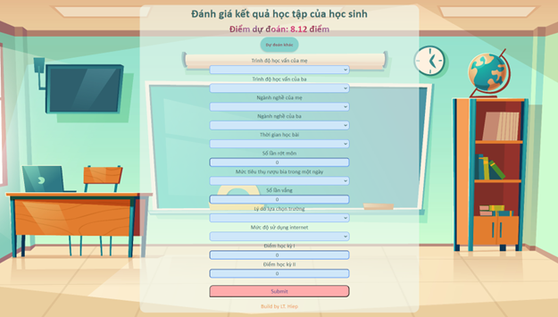

  <h1 align="center">Analyzing & Evaluating Student Learning Capabilities</h1>

## 📋 Table of Contents
- [📚 Introduction](#-introduction)
- [🔍 Dataset](#-dataset)
- [🧠 Machine Learning Models](#-machine-learning-models)
- [🏋️ Training](#️-training)
- [💻 Web Application](#-web-application)
- [🛠️ Requirements](#️-requirements)
- [🚀 Getting Started](#-getting-started)
- [📈 Future Improvements](#-future-improvements)
- [🤝 Contributing](#-contributing)

## 📚 Introduction

This project focuses on evaluating students' learning capabilities by analyzing their activities, attitudes towards learning, and the impact of various external influences. We utilize machine learning techniques to predict student performance and identify key factors affecting academic success.

## 🔍 Dataset

The dataset comprises information on **649** students from two secondary schools in Portugal (2019). It includes:

- Students' scores
- Demographic information
- Social characteristics
- School-related features

Data was collected through school reports and questionnaires. 

**Important Note:** The target attribute **G3** (final year score) is closely correlated with **G1** and **G2** (1st and 2nd term scores, respectively).

## 🧠 Machine Learning Models

### Regression Models
- KNeighborsRegressor
- SVR (Support Vector Regression)
- RandomForestRegressor
- GradientBoostingRegressor
- DecisionTreeRegressor

### Binary Classification Models
- GradientBoostingClassifier
- MultinomialNB
- DecisionTreeClassifier
- LinearSVC
- SGDClassifier
- KNeighborsClassifier
- RandomForestClassifier

## 🏋️ Training

The dataset was split into training and test sets with an **80:20** ratio. Model performance was evaluated on both sets:

### Regression Models Performance

   

### Binary Classification Models Performance

   

### Top Performing Models

| Model | Recall | Precision | F1-score | Accuracy |
|-------|--------|-----------|----------|----------|
| LinearSVC (C=1, loss='squared_hinge') | 0.90 | 0.83 | 0.86 | 0.94 |
| RandomForestClassifier (n_estimators=50, criterion='gini') | 0.87 | 0.83 | 0.85 | 0.94 |

## 💻 Web Application

We developed a simulation app using the **Flask** framework, allowing users to input student information and receive predictions about their learning capabilities.

   
  <em>Input Interface</em>

   
  <em>Prediction Output</em>

   
  <em>Detailed Results</em>

## 🛠️ Requirements

- Python 3.10
- scikit-learn
- pandas
- underthesea
- Flask 3.0

## 🚀 Getting Started

1. Clone the repository: `https://github.com/hieplt23/student_grade_prediction.git`
2. Run the Flask application: `python app.py`
3. Open your web browser and navigate to `http://localhost:5000` to use the application.

## 📈 Future Improvements

- Implement more advanced machine learning models
- Enhance the web interface for better user experience
- Incorporate real-time data updates for more accurate predictions

## 🤝 Contributing

Contributions are welcome! Please feel free to submit a Pull Request.
