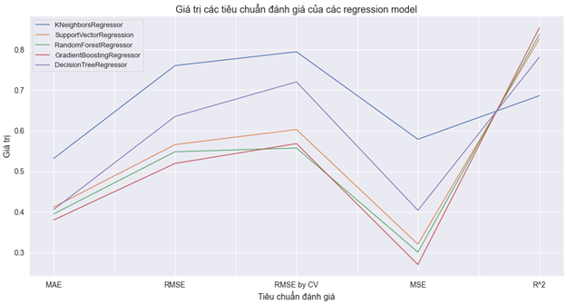
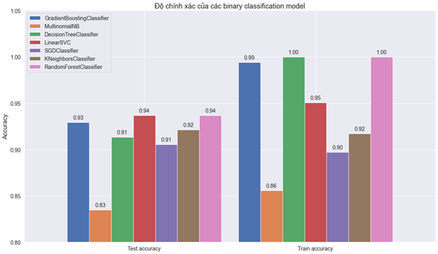

 <h1 align="center">Analyzing & Evaluating Student Learning Capabilities</h1>

## Introduction

Hello, this is a project about evaluating a student's learning capabilities through information based on their activities and attitudes towards learning, as well as analyzing the impact of various external influences.
## Dataset
This data approaches the achievements of 649 students in secondary education from two schools in Portugal (2019). The data attributes include students' scores, demographic, social, and school-related characteristics, collected using school reports and questionnaires. An important note: the target attribute **G3** is closely correlated with the attributes **G2** and **G1**. This occurs because **G3** represents the final year score (awarded in the 3rd term), while **G1** and **G2** correspond to the scores of the 1st and 2nd terms, respectively.

## Trained models

* 5 Regression models: **KNeighborsRegressor, SVR, RandomForestRegressor, GradientBoostingRegressor, DecisionTreeRegressor.**

* 7 Binary classification models: **GradientBoostingClassifier, MultinomialNB, DecisionTreeClassifier, LinearSVC, SGDClassifier, KNeighborsClassifier, RandomForestClassifier.**

## Training

The training data is split at a ratio of **8 : 2**. Below are the results of each model's predictions based on both the training and test sets:
* **Regression models:**

 

* **Binary classification models:**

 

* **Finally, here are the 2 models selected along with the choice of optimal hyperparameters:**
  
|      Model                                                  |      Recall     |   Precision   |   F1-score     |				Acc         |
|-------------------------------------------------------------|:---------------:|:-------------:|:--------------:|:--------------:|
|   LinearSVC (c=1, loss=squared_hinge)                       |      0.9        |      0.83     |   0.86         |      0.94      |
| RandomForestClassifier (n_estimators = 50, criterion = gini)|       0.87      |      0.83     | 	0.85          |       0.94     |

## APP

Construct a simulation app using the **Flask** library, allowing users to input information and print out predictions about the student's learning capabilities, below is an image description:

   
  <i>input</i>

   
  <i>output</i>

   
  <i>more result</i>

## Requirements

* **python 3.10**
* **scikit-learn**
* **pandas**
* **underthesea**
* **flask 3.0**
